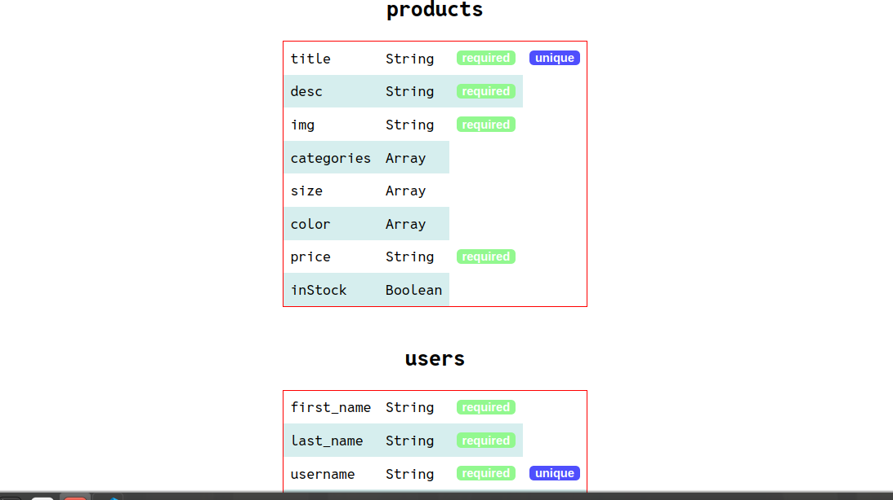

# dbdrawer-mongo

a cli tool for visualising your mongoose database schema. dbdrawer-mongo checks the data model schemas of your project ("./models) folder and visualises by running on localhost in node environment. it attaches to your project as an npm package.

currently, we have support only for mysql2 and mongodb mongoose.
For,  mysql2 check: https://github.com/Bhanu-code/db-drawer


## Installation

Install dbdrawer with npm

```javascript
//install using npm
npm install -g dbdrawer-mongo
//open terminal and type
dbdrawm
// hit enter and it will run localhost where you can see your schema, relationship and constraints in a tablular format
```
    
## Screenshots



## Contributing

Contributions are always welcome!

See `contributing.md` for ways to get started.

Please adhere to this project's `code of conduct`.


## License

[MIT License](LICENSE)

