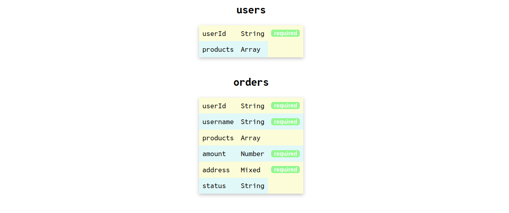

# dbdrawer-mongo

a cli tool for visualising your mongoose schema. dbdrawer-mongo checks the data model schemas of your project ("./models") folder and visualises by running on localhost in node environment. it attaches to your project as an npm package.

currently, we have support only for sequelize and mongoose.
For,  sequelize check: https://github.com/Bhanu-code/db-drawer


## Installation

Install dbdrawer-mongo with npm

```javascript
//install using npm
npm install -g dbdrawer-mongo
//open terminal and type
dbdrawm
// hit enter and it will run localhost where you can see your schema, relationship and constraints in a tablular format
```
    
## Screenshots



## Local Setup

```javascript
//To setup the project locally, for the repository and copy the forked copy the https url
//in the terminal write
git clone [repo-url]
cd dbdrawer-mongo
npm install
// have a project that has "models" folder
//install dbdrawer-mongo to the project globally
npm install -g 
//run the command 'dbdrawm'
dbdrawm
//create a branch, makes changes and raise PR

//open terminal and type
dbdrawm
// hit enter and it will run localhost where you can see your schema, relationship and constraints in a tablular format
```


## Contributing

Contributions are always welcome!

See `contributing.md` for ways to get started.

Please adhere to this project's `code of conduct`.


## License

[MIT License](LICENSE)

